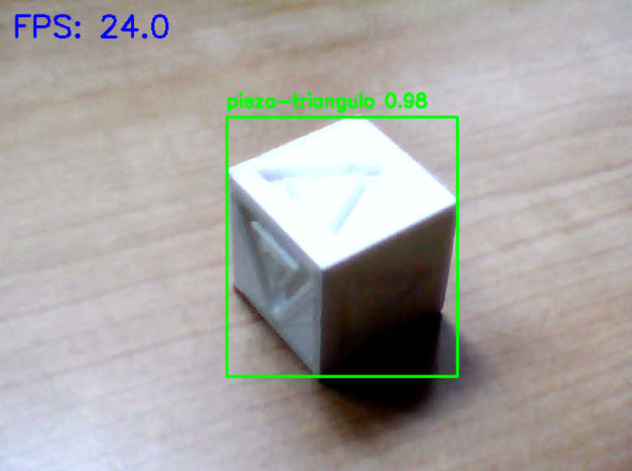
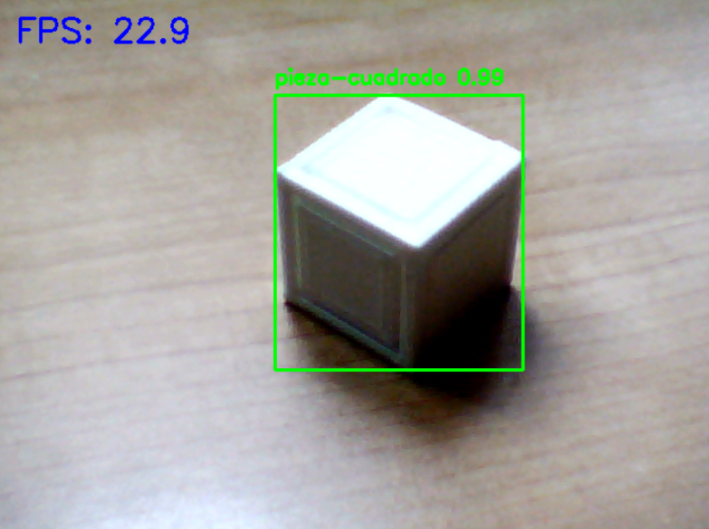
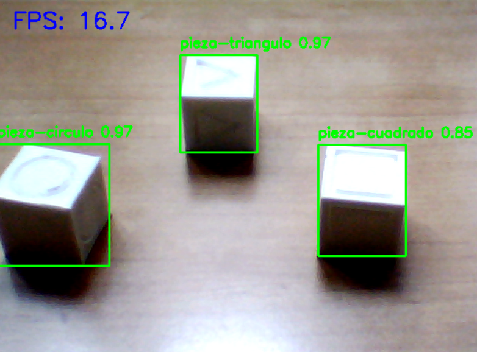

# Mechatronics-proyect-with-Computer-Vision-and-MQTT

This repository gathers the parts of a Mechatronics project that I found most interesting.

The system implements a distributed architecture in which an **ESP32** acts as the main controller, communicating via **MQTT** with a computer vision system based on **YOLOv8** and with a **web interface** for supervision and remote control.

---

## 🧠 System Overview

The system is capable of automatically sorting parts using computer vision. Its operation is based on:

- **Computer vision** to detect and classify parts in real time.
- **MQTT** as the communication protocol between the different subsystems.
- **ESP32** as the core controller of the physical system.
- **Web interface** for system monitoring and command transmission.

The architecture is designed to be **modular, scalable, and easy to debug**, clearly separating perception, control, and supervision layers.

---

## 👁️ Computer Vision

Part classification is performed using a **YOLOv8** model trained with a **custom dataset** created and labeled using **Roboflow**.

The vision system publishes the detected part type via MQTT, allowing the controller to make real-time decisions without tightly coupling both systems.

### Detection Results

  
  

  
  

---

## 📡 MQTT Communication

All communication between subsystems is handled using **MQTT**, enabling loose coupling and modularity.

Different *topics* have been defined for:
- System state publication
- Detected part type transmission
- Command reception from the web interface

**MQTT Explorer** was used during development to monitor and debug message traffic.

### MQTT Topic Structure

  

---

## 🌐 Web Interface

A web interface was developed using **FastAPI**, allowing:
- Real-time visualization of the system state
- Display of the last detected part
- Remote command transmission to the controller

The web application acts as a supervision layer without directly interfering with the control logic.

  

---

## 🛠️ Technologies Used

- **ESP32**
- **Python**
- **YOLOv8**
- **Roboflow**
- **MQTT**
- **FastAPI**
- **MQTT Explorer**

---

## 📌 Final Notes

This repository focuses on the **software, communications, and computer vision** aspects of the project, leaving out purely mechanical and manufacturing details, which are part of the complete Mechatronics project.
